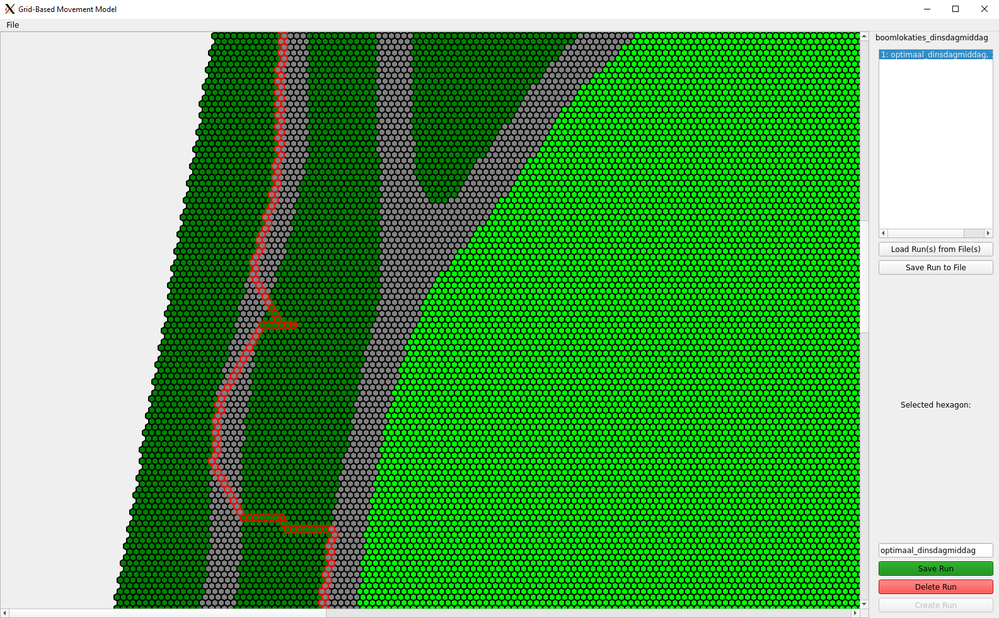

# Bachelor's Project



As part of our bachelor's thesis's analysis we created a 2D hexagonal grid model. This model converts a land cover map to a hexagonal grid with each tile having a land cover type. For our project we used a land cover map of a park in Amsterdam called Flevopark, which can be found in the data folder. In this park, an experiment was conducted where two teams had to search for 'ribbons', which were tied around trees, on multiple days with varying spatial arrangements of ribbons. This model was originally meant to simulate 'search trials' with human-like search behaviour. Due to time constraints we have not implemented this feature. However, the A-star algorithm can be used to produce optimal routes between the tree locations. These tree locations were trees that had ribbons tied around them on specific days of the experiment. These optimal routes were compared to the real-life routes to analyse the deviations from the optimal routes.

## Getting Started

### Prerequisites

This code base is written in Python 3.8.5 and up.
Other requirements such as packages, can be installed by entering the following command:

```
pip3 install -r requirements.txt
```

Or using conda:

```
conda install --file requirements.txt
```

### Usage

You can run the application using:

```
python3 main.py
```

### Structure

The following list provides the most important directories and files:

- **/code**: contains all code in this project
  - **/code/classes**: classes used in this project
  - **/code/visualisation**: code for the PyQT5 application
- **/data**: contains all the data files
  - **/data/map_corrections**: .csv files adding small footpaths to the map.
  - **/data/runs**: output location for the model's runs. Contains an example of a run.
  - **/data/tree_locations**: .csv files with the GPS coordinates of tree locations in the park.
  - **/data/map.png**: the land cover map of the park used to create the grid.
- **/docs**: contains a screenshot of the UML diagram.

## Acknowledgements

[hexutil](https://github.com/stephanh42/hexutil)\
The hexutil module of stephanh42 has been hugely important as it is the foundation of the model. On top of that, many ideas and implementations were inspired by his repository.\
\
[hexagonpy](https://github.com/McJazzy/hexagonpy)\
The logic and code related to the conversion of the land cover map to the grid was copied from McJazzy's hexagonpy repository.

## Authors
- Joris Oud
- Liam Adam